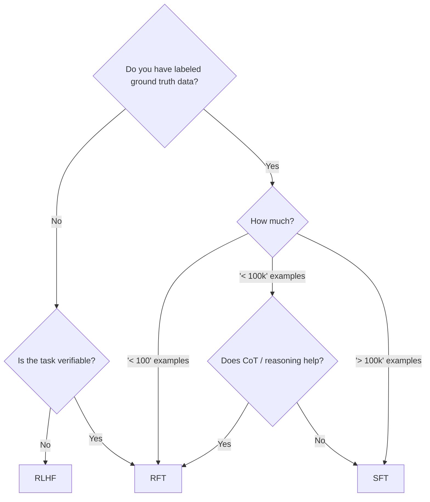

# GRPO (Group Relative Policy Optimization) Hands-on

This repository contains hands-on experiments with Group Relative Policy Optimization (GRPO), as introduced in the [Reinforcement Fine-Tuning LLMs with GRPO](https://learn.deeplearning.ai/courses/reinforcement-fine-tuning-llms-grpo) course by DeepLearning.AI.

---

## Evolution of LLM Fine-Tuning Methods

### 1. Supervised Fine-Tuning (SFT)

**Process:**
- **Forward Pass:** Training Dataset → LLM → Predictions  
- **Backward Pass:** Predicted Output → Compute Loss (difference from ground truth) → Update Weights to Minimize Loss → Improved LLM

**Limitations:**
1. Requires thousands of labeled data points.
2. Risk of overfitting—model may not generalize well to unseen data.

---

### 2. Reinforcement Learning Approaches

LLMs interact with an environment, take actions, receive rewards, and update to maximize cumulative rewards.

**Example Workflow:**  
Example → Prompt → LLM → Generate Response → Score Response (Reward) → Update LLM  
↺ Repeat

#### 2.1. RLHF (Reinforcement Learning from Human Feedback)

- For each input, generate multiple responses by varying temperature.
- Humans rank the responses.
- Use rankings to train a reward model.
- Update LLM weights using the reward model and PPO (Proximal Policy Optimization).

#### 2.2. DPO (Direct Preference Optimization)

- For each input, generate **two** responses by varying temperature.
- Human selects the preferred response.
- Build a preference dataset (A > B).
- Update LLM weights using the DPO algorithm.

#### 2.3. GRPO (Group Relative Policy Optimization)

- For each input, generate multiple responses by varying temperature.
- Use a reward function to score each response.
- Update LLM weights using the responses, scores, and the GRPO algorithm.

---

# Comparison: RLHF vs DPO vs GRPO

| **Comparison Aspect**  | **RLHF**                                              | **DPO**                                                     | **GRPO**                                                                                                                                |
| ---------------------- | ----------------------------------------------------- | ----------------------------------------------------------- | --------------------------------------------------------------------------------------------------------------------------------------- |
| **Human Involvement**  | High — Requires ranking multiple responses per sample | Moderate — Requires choosing between two options per sample | Minimal — Focused on defining reward functions to verify outputs                                                                        |
| **Data Needed**        | Ranked generations for reward model                   | Paired preference labels (A > B)                            | Minimal — Requires as few as 10 data points or none, relying only on logic to verify responses                                          |
| **Compute / Memory**   | Very high                                             | Moderate                                                    | Low — GRPO eliminates the need for a value (critic) model, reducing compute and memory requirements by nearly half compared to RLHF/PPO |
| **Training Stability** | Often unstable — Prone to reward hacking and collapse | More stable but requires many labels                        | Highly stable — Uses group-based reward normalization to reduce variance and strengthen learning signals                                |
| **Generalization**     | Steers preferences only, doesn’t teach new tasks      | Steers preferences only, doesn’t teach new tasks            | Actively improves tasks, leveraging Chain of Thought (CoT) reasoning for organic evolution                                              |

---

## Decision Guide: When to Choose RLHF, SFT, or GRPO

## Classic Use Cases for GRPO

GRPO is particularly effective in the following scenarios:

* **Mathematical Problem Solving**: Tasks where solutions are easily verifiable.
* **Code Generation and Debugging**: Processes that allow straightforward verification of outputs.
* **Logical and Multi-step Reasoning**: Scenarios where Chain of Thought (CoT) or reasoning provides significant benefits.

## Cautions for Using GRPO

When implementing GRPO, it is essential to address the following challenges to ensure optimal performance:

* **Group Reward Uniformity / AGPO**: Prevent zero variance in rewards, which can destabilize training.
* **Prompt Diversity**: Avoid overfitting by ensuring prompts are varied and representative.
* **Group Size Tuning**: Select an appropriate group size to balance meaningful variance with noise minimization.
